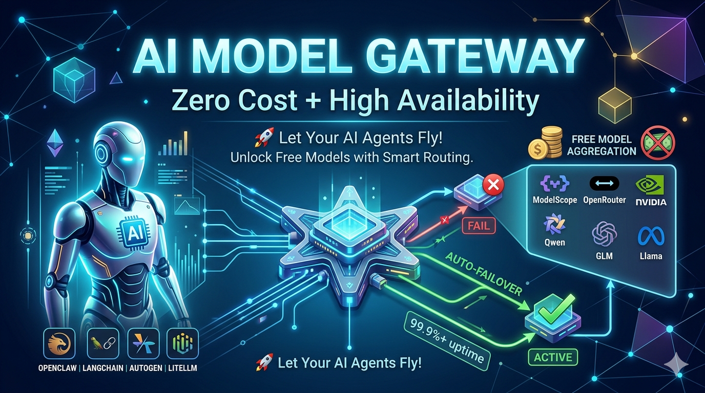

# 🤖 AI Model Gateway



[](LICENSE)
[](https://www.python.org/downloads/)
[](https://fastapi.tiangolo.com/)
[](https://github.com/psf/black)

> **Smart Multi-Platform Free AI Model Gateway** — Auto failover, load balancing, protocol conversion, OpenAI-compatible API
>
> **智能多平台免费 AI 模型网关服务** — 自动切换、负载均衡、协议转换、OpenAI 兼容接口

💡 **Positioning:** Supports **any platform providing OpenAI-compatible APIs**. Built-in plugins can automatically scrape free models from ModelScope, NVIDIA, and OpenRouter; other platforms require manual configuration.

🌐 Languages: [中文](README.md) | [English](README_EN.md)

**[Quick Start](#-quick-start)** · **[API Reference](#-api-reference)** · **[Configuration Guide](docs/CONFIGURATION_GUIDE.md)** · **[Monitoring](docs/MONITORING.md)** · **[Contributing](#-contributing)**

---

## ✨ Why Choose This Project?

### 🎯 Core Value

Are you facing these issues?
- ❌ Free models often fail or run out of quota
- ❌ Need to manually maintain API keys and configs for multiple platforms
- ❌ Outdated model lists, can't get newly released free models in time
- ❌ Non-standard tool call formats (NVIDIA JSON, Minimax XML) break compatibility
- ❌ Lack of monitoring, don't know which platform has problems

**AI Model Gateway** solves these problems for you:

- 🔄 **Smart Failover**: Automatically switch to backup platforms when one fails
- ⚖️ **Weighted Load Balancing**: Distribute requests based on configured priorities
- 🔌 **Plugin Scheduler System**: Scheduled web scraping (Playwright) for latest free models
- 🛡️ **Smart Error Classification**: 7 error types with precise retry/disable strategies
- 🔧 **Tool Call Converter**: Auto-convert non-standard formats (NVIDIA JSON, Minimax XML) to OpenAI standard
- 📡 **OpenAI Responses API**: Full `/v1/responses` endpoint with protocol conversion
- 🔑 **Bearer Token Auth**: Optional `GATEWAY_API_KEY` to protect all endpoints
- 📊 **Prometheus Monitoring**: Real-time metrics for requests, latency, errors
- 🚀 **Zero Client Changes**: Fully compatible with OpenAI API

## 🆕 Core Features

| Feature                        | Description                                                                      |
| ------------------------------ | -------------------------------------------------------------------------------- |
| **Responses API**              | Full `/v1/responses` support, bidirectional Chat ↔ Responses protocol conversion |
| **Tool Call Converter**        | Auto-detect NVIDIA JSON / Minimax XML and convert to standard `tool_calls`       |
| **Streaming Tool Call Buffer** | Intelligent buffer for streaming non-standard tool calls                         |
| **Tool Capability Testing**    | Auto-test tool call support on model discovery, keep only supported models       |
| **Model Retry Mechanism**      | Configurable `retry_count`, intelligent retry based on error type                |
| **Model Alias & Blacklist**    | `all_aliases` for multiple aliases, `blacklist` with glob pattern matching       |
| **GATEWAY_API_KEY Auth**       | Optional Bearer Token authentication for all API endpoints                       |
| **Redis Cache & Sessions**     | Response caching + Responses API session history, auto-fallback to file storage  |
| **SSE Normalization**          | Unified SSE event format, eliminating duplicate code across endpoints            |
| **Error Classification**       | 7 error types (timeout/connection/auth/rate-limit/server/format/model)           |
| **SKIP_PLUGIN_SCRAPER**        | Skip plugin scraper and use cached models, ideal for offline environments        |
| **Docker One-click Deploy**    | Built-in Redis, Playwright, ready-to-run containerized deployment                |

### 📊 Comparison with Traditional Solutions

| Feature              | This Project                 | Direct Platform API  | Other Proxy Solutions |
| -------------------- | ---------------------------- | -------------------- | --------------------- |
| Auto Failover        | ✅ Smart switching            | ❌ Manual handling    | ⚠️ Partial support     |
| Multi-Platform       | ✅ 5+ platforms               | ❌ Single platform    | ⚠️ 2-3 platforms       |
| Dynamic Models       | ✅ Plugin scheduler + scraper | ❌ Manual maintenance | ❌ Static config       |
| OpenAI Responses API | ✅ Full support               | ❌ Chat only          | ❌ Not supported       |
| Tool Call Conversion | ✅ NVIDIA/Minimax/etc         | ❌ Manual handling    | ❌ Not supported       |
| Monitoring           | ✅ Prometheus                 | ❌ None               | ⚠️ Basic logging       |
| Error Classification | ✅ 7 types                    | ❌ Unified handling   | ⚠️ Simple              |
| Cache                | ✅ Memory/Redis               | ❌ None               | ⚠️ Basic               |

---

## 🚀 Quick Start

### 1️⃣ Installation

```bash
git clone https://github.com/tfwcn/ai-model-gateway.git
cd ai-model-gateway
pip install -r requirements.txt
playwright install --with-deps chromium
```

### 2️⃣ Configuration

```bash
cp .env.example .env
cp models.example.yaml models.yaml
nano .env  # Fill in your API keys (optionally set GATEWAY_API_KEY)
```

### 3️⃣ Start

Run directly (default port 8000):

```bash
python run.py
```

Or use the startup script (auto-manages Redis and virtual env, default port 8100):

```bash
bash start.sh               # default port 8100
bash start.sh --port 8000   # specify port
```

You can also set the port via environment variable:

```bash
PORT=8000 python run.py
PORT=8000 bash start.sh
```

### 4️⃣ Test

```bash
# List available models
curl http://localhost:8000/v1/models

# Chat completion
curl http://localhost:8000/v1/chat/completions \
  -H "Content-Type: application/json" \
  -d '{
    "model": "all",
    "messages": [{"role": "user", "content": "Hello!"}]
  }'

# Responses API
curl http://localhost:8000/v1/responses \
  -H "Content-Type: application/json" \
  -d '{
    "model": "all",
    "input": "Hello!"
  }'
```

---

## 📡 API Reference

### Endpoints

| Endpoint               | Method | Description                                           |
| ---------------------- | ------ | ----------------------------------------------------- |
| `/v1/chat/completions` | POST   | OpenAI Chat Completions (auth required)               |
| `/v1/responses`        | POST   | OpenAI Responses API (auth required)                  |
| `/v1/models`           | GET    | List models with filtering/pagination (auth required) |
| `/health`              | GET    | Basic health check (no auth)                          |
| `/health/detailed`     | GET    | Detailed health check                                 |
| `/metrics`             | GET    | Prometheus metrics                                    |

### Model Selection

Three selector formats:
- **`"all"`** — All platforms, sorted by weight (default)
- **`"modelscope"`** — Specific platform
- **`"modelscope|Qwen/Qwen2.5-7B-Instruct"`** — Specific model on specific platform

`/v1/models` supports query params: `provider`, `capability`, `q`, `limit`, `offset`.

---

## 🏗️ Architecture

```
┌─────────────┐
│   Client    │ (Any OpenAI-compatible client)
└──────┬──────┘
       │
       ▼
┌──────────────────────────────────────────┐
│          AI Model Gateway                │
│                                          │
│  ┌────────────────────────────────────┐  │
│  │         FastAPI Routes             │  │
│  │  /v1/chat/completions              │  │
│  │  /v1/responses (protocol convert)  │  │
│  │  /v1/models (filtered/paginated)   │  │
│  │  /health /metrics                  │  │
│  └──────────┬─────────────────────────┘  │
│             │                             │
│  ┌──────────▼─────────────────────────┐  │
│  │       Failover Manager             │  │
│  │  ┌──────────┐  ┌────────────────┐  │  │
│  │  │ Weight   │  │ Failover/Retry │  │  │
│  │  │ Sort     │  │                │  │  │
│  │  └──────────┘  └────────────────┘  │  │
│  │  ┌──────────┐  ┌────────────────┐  │  │
│  │  │ Error    │  │ Model State    │  │  │
│  │  │ Classifier│  │ Manager       │  │  │
│  │  └──────────┘  └────────────────┘  │  │
│  └────────────────────────────────────┘  │
│                                          │
│  ┌──────────┐  ┌──────────┐             │
│  │ Plugins  │  │  Cache   │             │
│  │(Scraper) │  │ (Memory/ │             │
│  │(Scheduler)│  │  Redis)  │             │
│  └──────────┘  └──────────┘             │
│  ┌────────────────────────────────────┐  │
│  │  Responses Adapter                 │  │
│  │  Chat ↔ Responses protocol convert │  │
│  │  Streaming event + session mgmt    │  │
│  └────────────────────────────────────┘  │
└──────┬──────────┬───────────────────────┘
       │          │
       ▼          ▼
┌──────────┐ ┌──────────┐
│Platform A│ │Platform B│ ... (Multiple platforms)
└──────────┘ └──────────┘
```

### Core Modules

- **Core**: Config loader, plugin manager, cache abstraction (MemoryCache / RedisCache)
- **Model**: Failover manager, error classifier (7 types), model state manager, tool capability tester
- **Scraper**: Playwright web scraper base + APScheduler scheduled tasks
- **Adapter**: Responses API ↔ Chat API protocol converter
- **Utils**: SSE event parser, tool call converter, streaming tool call buffer, Prometheus metrics, session store (Redis/File dual-mode)

---

## 🔧 Configuration

### Environment Variables

```env
MODELSCOPE_API_KEY=your-modelscope-api-key
OPENROUTER_API_KEY=your-openrouter-api-key
NVIDIA_API_KEY=your-nvidia-api-key
OPENAI_API_KEY=your-openai-api-key
GATEWAY_API_KEY=your-gateway-api-key   # Optional auth
REDIS_URL=redis://localhost:6379       # Optional Redis

# Skip plugin scraper, use cached models directly (optional)
# SKIP_PLUGIN_SCRAPER=true

# Logging configuration (optional)
# DEBUG=true                           # Enable DEBUG level logs (default INFO)
# ENABLE_CONSOLE_LOGS=false            # Disable console output (default true)
# LOG_DIR=logs                         # Log directory (default logs/)
```

### Platform Config Example

```yaml
modelscope:
  baseUrl: "https://api-inference.modelscope.cn/v1"
  apiKey: "${MODELSCOPE_API_KEY}"
  weight: 10
  timeout: 30
  quota_period: "daily"
  retry_count: 3
  plugin:
    code: "plugin.modelscope"
    cache_timeout: 3600       # Model list cache TTL (seconds)
    args:
      scrape_url: "https://www.modelscope.cn/models?filter=inference_type&page=1&sort=default&tabKey=task"
      max_models: 10
      scraper_timeout: 60
      headless: true          # Run browser in headless mode
      enable_tool_capability_test: true
      enable_scheduled_task: true
      schedule_cron: "0 2 * * *"   # Run daily at 2 AM
  blacklist:                  # Blacklist (supports * glob pattern)
    - "iic/*"
  models: []                  # Static model list (optional)
```

See [📖 Configuration Guide](docs/CONFIGURATION_GUIDE.md) for details.

---

## 📖 Documentation

- [🔧 Configuration Guide](docs/CONFIGURATION_GUIDE.md)
- [🐳 Docker Deployment](docs/DEPLOYMENT.md)
- [🚨 Security](docs/SECURITY.md)
- [📋 Roadmap](docs/ROADMAP.md)
- [📊 Monitoring](docs/MONITORING.md)
- [⚡ Load Balancing](docs/LOAD_BALANCING.md)
- [🛡️ Error Classification](docs/error-classification.md)
- [🧪 Error Classification Testing](docs/error-classification-testing.md)
- [🔧 Tool Call Converter](docs/TOOL_CALL_CONVERTER.md)
- [📡 Responses API Protocol](docs/protocol_summary.md)
- [🔌 Plugin FAQ](docs/PLUGIN_FAQ.md)

### Migration Guide

- [🔄 Version Migration Guide](docs/MIGRATION_GUIDE.md) — Step-by-step upgrade instructions

---

## 🤝 Contributing

```bash
git clone https://github.com/tfwcn/ai-model-gateway.git
cd ai-model-gateway
pip install -r requirements.txt
pip install -r requirements-dev.txt
pytest tests/ -v --tb=short
black openai_proxy/
mypy openai_proxy/
```

1. Fork the repo
2. Create feature branch (`git checkout -b feature/amazing-feature`)
3. Commit changes (`git commit -m 'Add amazing feature'`)
4. Push (`git push origin feature/amazing-feature`)
5. Open a Pull Request

---

## 📄 License

MIT License — see [LICENSE](LICENSE)

---

## 🙏 Acknowledgments

- [FastAPI](https://fastapi.tiangolo.com/)
- [aiohttp](https://docs.aiohttp.org/)
- [Playwright](https://playwright.dev/)
- [Prometheus](https://prometheus.io/)
- [APScheduler](https://apscheduler.readthedocs.io/)
- [pydantic](https://docs.pydantic.dev/)
- [Redis](https://redis.io/)

---

<div align="center">

**⭐ If this project helps you, please give it a Star!**

</div>